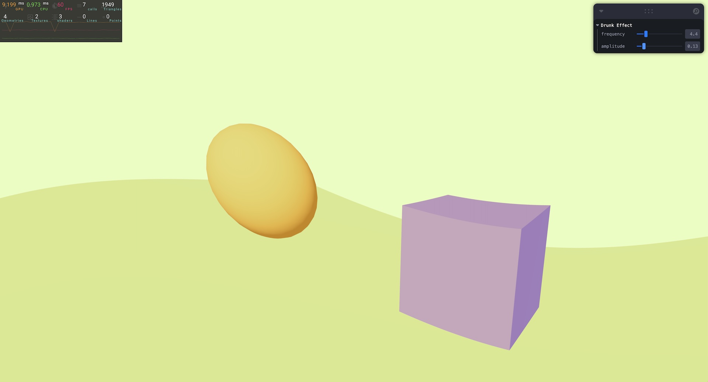

# Post-processing

This project explores post-processing in a 3D scene, allowing users to dynamically adjust the intensity of an animated, drunken wave effect applied over top of a simple scene. It was created with Three.js and React Three Fiber.

It features a ball and cube on a green plane. In the upper-right corner is a GUI that allows users to adjust two parameters that affect the "drunk" view distortion: frequency and amplitude.

The project also displays a performance monitor for profiling different performance indicators, such as FPS, memory usage, and GPU load.

The work was undertaken as one of many steps in acquiring [my Three.js certification](https://threejs-journey.com/certificate/view/24741) through [Three.js Journey](https://threejs-journey.com/).

## Live demo

A running demo of the project can be viewed at https://dvdjrnx.github.io/model-animations

## Local development

### Installation

1. Clone the repository.
2. Install the required dependencies by running `npm install`.

### Usage

To start the project, run the following command:

`npm run dev`
